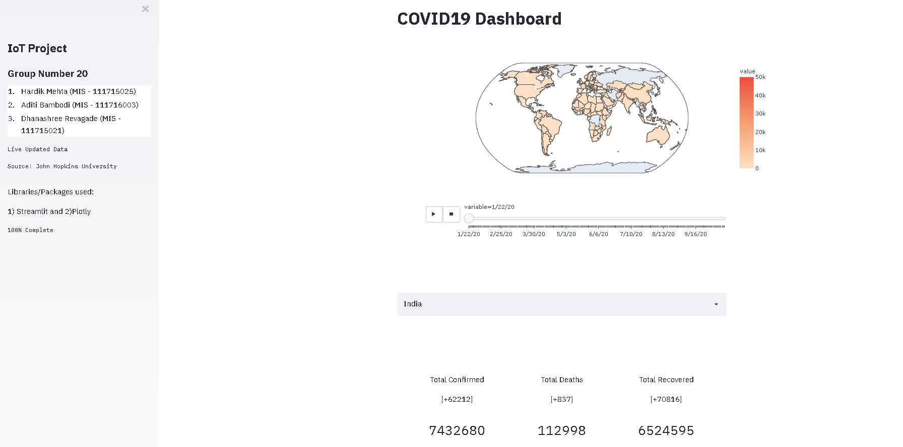
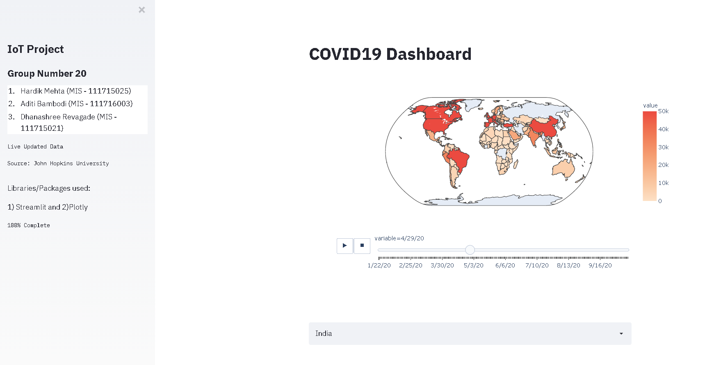
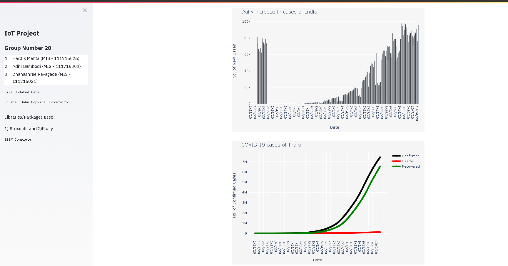
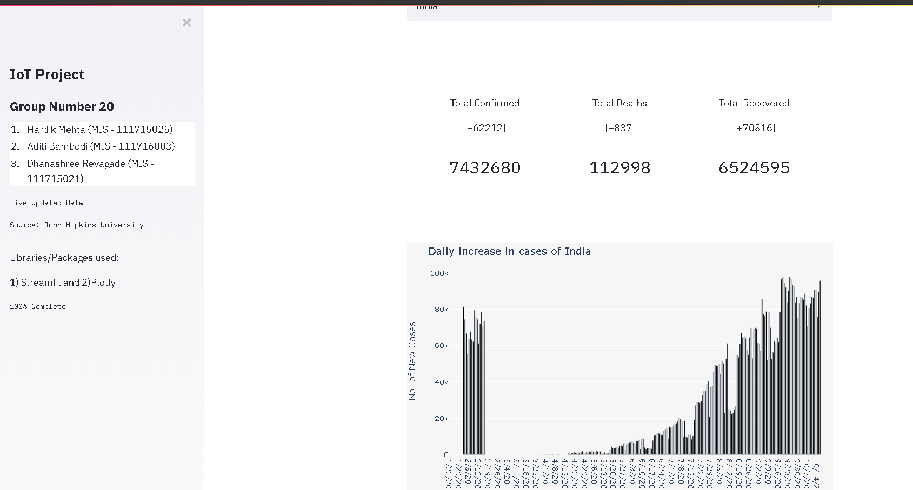
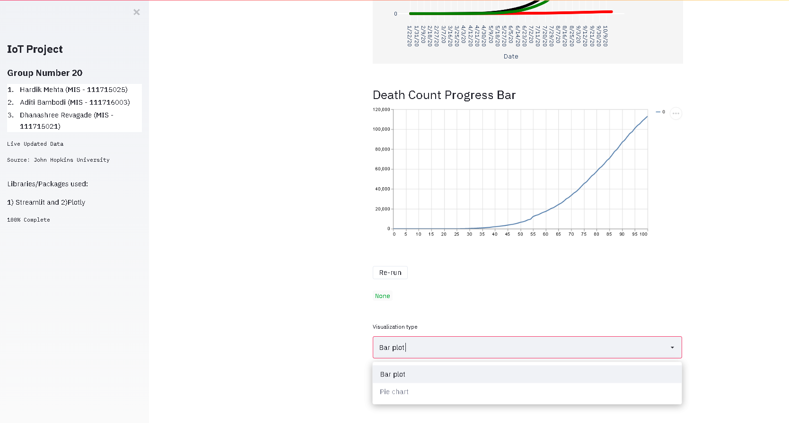
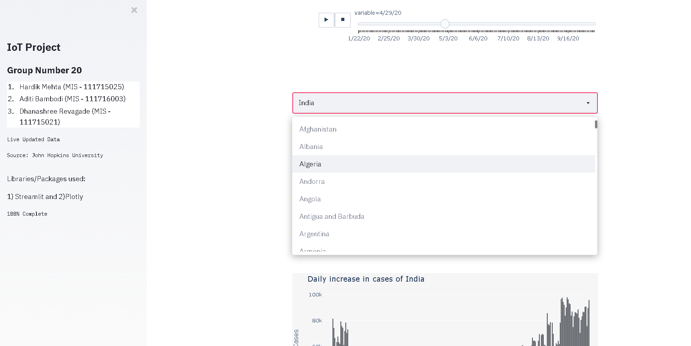
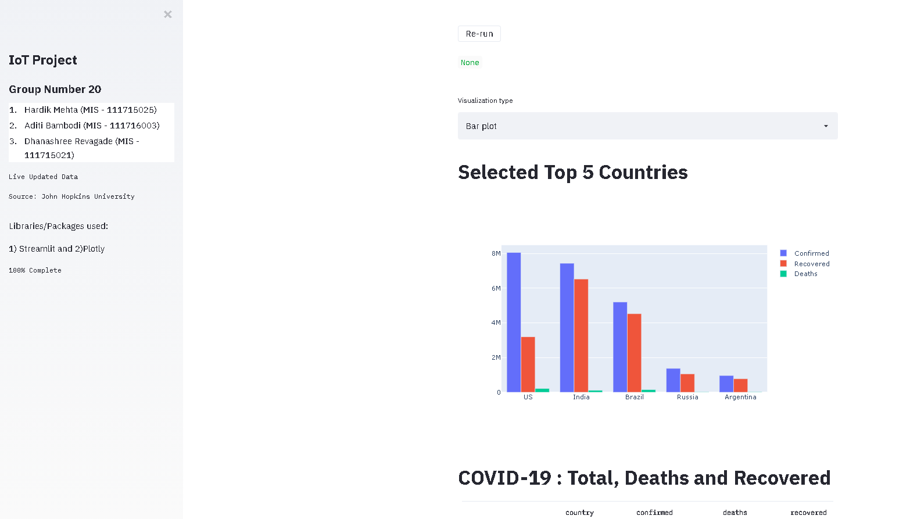
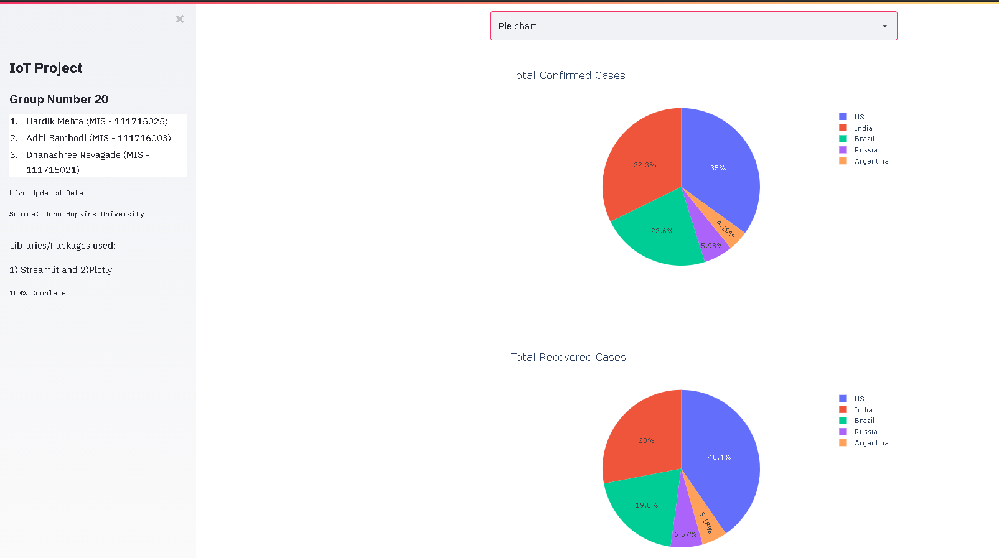
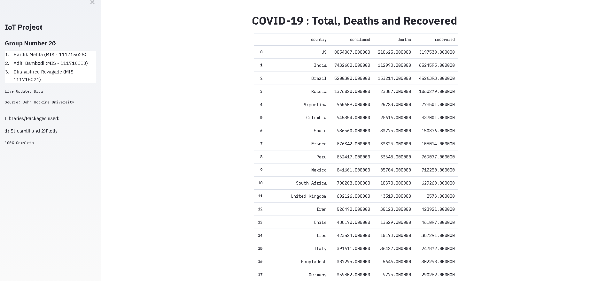

# COVID19-Dashboard

A live updated COVID-19 Dashboard to visualize the deaths, confirmed and recovered cases all around the world. 

Tools/Libraries
--
Python 3, Streamlit package, libraries - plotly, numpy, pandas

Team Members
--
1) Hardik Mehta
    (hardik.mehta48@gmail.com)
    
2) Dhanashree Revagade
    (dhanashree.revagade9@gmail.com)
    
3) Aditi Bambodi
    (abambodi3@gmail.com)
 

Data Source 
--
Johns Hopkins University Center Github Repository (https://github.com/CSSEGISandData/COVID-19)

Visualizations in the Dashboard 
--

1. A dynamic map visualizing the spreading of COVID-19 overtime through all countries.

2. Country-wise plots of confirmed,recovered cases and deaths.

3. Cards displaying the total cases counts worldwide.

4. Progression bar depicting the gradual increase in number of death for the selected country.

5. Graph showing the increase in daily cases for the selected country.

6. Bar charts and pie charts showing the top 5 countries with confirmed, deaths, and recovered cases.

7. A table ranking top 100 countries with the maximum confirmed cases.

THANK YOU
===

